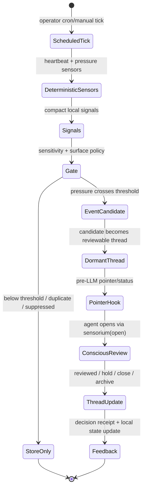
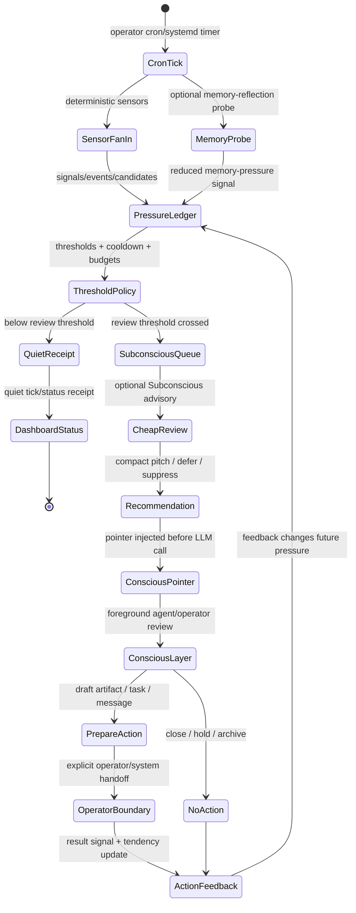

# Agent Sensorium

An environment-reactive attention substrate for Hermes agents. Agent Sensorium captures salient signals from the runtime environment, promotes them through a deterministic pipeline (signal → event → candidate → conscious thread capsule), and surfaces policy-gated action preparation for pull-based operator review. The result is a bounded, auditable, local-first attention layer: the agent accumulates deferred awareness without autonomous outbound behavior.

**Authority boundary.** Agent Sensorium is an attention substrate, not an outbound automation switch. It does not send messages, create tasks, or reach out on any platform without explicit operator configuration and a conscious-tier receipt from the agent. Sensitivity tuning, surface gating, and action policies are recorded in operator-controlled configuration files so the runtime boundary stays auditable.

---

## Goal

Agent Sensorium gives an agent a bounded way to notice, remember, and revisit operationally relevant signals without turning those signals into autonomous behavior.

The design target is:

1. **Sense cheaply.** Deterministic sensors and explicit ingests create compact local signals.
2. **Defer safely.** Signals are normalized, gated, and promoted into events/candidates only when policy allows.
3. **Surface intentionally.** The live agent sees a small pointer or status summary, not an unbounded dashboard dump.
4. **Require conscious review.** Thread capsules and outbound artifacts require an explicit foreground review/receipt path.
5. **Stay auditable.** State is local JSON/JSONL under a named profile; admin operations are separate from the live agent surface.

In short: Agent Sensorium is an attention substrate, not a task runner. It helps an agent accumulate pressure and context between turns, while keeping authority boundaries narrow and visible.

---

## Architecture overview

```text
Hermes runtime / cron / operator / sensors
        |
        v
Signals  →  Events  →  Candidates  →  Conscious thread capsules
        |        |          |                    |
        |        |          |                    v
        |        |          |         live sensorium(status/open/update)
        |        |          |
        |        |          v
        |        |    pre-LLM pointer hook
        |        |
        v        v
 local profile state: ~/.hermes/agent-sensorium/<profile>/
```

Core pieces:

- **Plugin registration (`agent_sensorium/plugin.py`)** — registers one live tool, the admin toolset, two `pre_llm_call` hooks, and the bundled skill.
- **Profile state (`agent_sensorium/store.py`, `config.py`)** — stores signals, events, candidates, threads, decisions, artifacts, and per-profile config under `~/.hermes/agent-sensorium/<profile>/`.
- **Gate and promotion pipeline (`gate.py`, `attention.py`, `threads.py`)** — normalizes salience, applies sensitivity/surface policy, and builds candidate/thread state.
- **Pre-LLM hooks (`pointers.py`, `pre_llm_salience.py`)** — inject compact reminders/pointers before model calls without mutating state.
- **Deterministic tick scripts (`scripts/sensorium_tick.py`)** — run heartbeat/pressure sensors, compaction, and thread service from cron or manual smoke tests.
- **Admin tools** — inspect and manage profiles, sensors, attention inboxes, artifacts, policies, and diagnostics.
- **Dashboard plugin (`dashboard/`)** — optional read-only FastAPI dashboard surface for profile state snapshots.

---

## Lifecycle loops

Agent Sensorium is meant to run as a loop: cheap sensing builds pressure over time; policy decides what is worth surfacing; a cheap review layer can argue for attention; the conscious agent/operator remains the only executive layer.

Sensorium does not install its own scheduler. Cron, systemd timers, or another operator-controlled scheduler call the tick script deliberately.

### Plain starting setup

The minimal install uses deterministic sensors only. It gives the agent a heartbeat, machine pressure signals, persisted state, and a pointer when something crosses the configured threshold.



Plain setup properties:

- **Sensing:** `scripts/sensorium_tick.py --heartbeat --all-sensors`.
- **Pressure:** transition sensors emit only when levels change; heartbeat emits a low-strength liveness signal.
- **Exposure:** only `sensorium(status|ingest|open|update)` in the live toolset.
- **Executive authority:** none in the sensing loop; the conscious agent/operator must review and update.

### Built-out review loop example

A richer deployment can add memory pressure, a cheap Subconscious advisory pass, dashboard visibility, and policy-gated action preparation. The important boundary is that Subconscious is an advocate, not an actor: it can compress pressure into a recommendation, but cannot dispatch, mutate config, or authorize action.



Example built-out tick shape:

```bash
python scripts/sensorium_tick.py \
  --instance demo \
  --heartbeat \
  --all-sensors \
  --memory-reflection \
  --subconscious-advisory \
  --subconscious-model \
  --json
```

Use the model-backed flags only when the operator has chosen a cheap review model and wants that review lane active. Without those flags, the tick stays deterministic and model-free.

---

## Runtime process

Typical flow:

1. **Install plugin snapshot** into `~/.hermes/plugins/agent-sensorium/` and restart/new-session Hermes so tools/hooks are discovered.
2. **Initialize a profile** (`default`, `demo`, or deployment-specific) with `sensorium_profile` or `scripts/sensorium_demo_seed.py`.
3. **Register or seed sensors** into that profile's `sensors/registry.json`.
4. **Run ticks deliberately** — manually, cron, or another operator-controlled scheduler. Ticks emit compact signals and receipts; they do not reach out by themselves.
5. **Before LLM calls**, hooks may inject a compact pointer that something is waiting for review.
6. **During normal conversation**, the agent only gets the live `sensorium` aperture: `status`, `ingest`, `open`, `update`.
7. **When a candidate needs attention**, the agent opens the thread capsule, reviews it consciously, and either marks it reviewed/held/closed or prepares a local artifact for an explicit operator/system handoff.

The live tool is deliberately small; setup, diagnostics, and policy changes belong to the admin toolset.

---

## Live tool vs admin toolset

### Live surface — `agent-sensorium-live`

A single tool `sensorium` with four actions. This is the only surface exposed to the agent during normal operation. It always operates on the active/default profile — no profile argument is needed for ordinary use:

| Action | Purpose |
|--------|---------|
| `status` | Read current attention state: pending threads, pointer, inbox |
| `ingest` | Record deferred salience from the current session as a compact signal |
| `open` | Open a dormant conscious thread capsule by id |
| `update` | Apply a lifecycle keyword to an open thread |

The live surface is intentionally tiny. The agent cannot diagnose internals, reconfigure sensors, or dispatch artifacts through it.

### Admin surface — `agent-sensorium-admin`

A separate toolset for operator setup, diagnostics, and management. Load it only when needed — it is not surfaced to the live agent. Key tools:

- **`sensorium_profile`** — profile lifecycle: `list`, `show`, `init`, `set_default`.
- **`sensorium_sensor_config`** — sensor registry management: `list`, `register`, `modify`, `pause`, `deprecate`. Config-only; never runs sensors.
- Granular ingest, thread service, subconscious advisory, artifact, attention-policy, and improvement tools for operator inspection and controlled intervention.

---

## Profiles and configuration

A *profile* is a named runtime namespace under `~/.hermes/agent-sensorium/<profile>/`. Each profile has its own `instance.config.json`, signal/event/candidate/thread state, and sensor registry. The `default` profile is the portable fallback; multiple profiles (e.g. `default`, `demo`) can coexist.

**Active profile resolution order:** env var `AGENT_SENSORIUM_DEFAULT_INSTANCE` → env var `SENSORIUM_INSTANCE` → `active_profile.json` marker (set via `sensorium_profile set_default`) → Hermes config `agent_sensorium.default_instance` → `default`.

### Code/config boundary

The plugin ships generic reusable code. Deployment-specific values are read from the per-profile `instance.config.json`, not baked in. New config fields adopters can set (all have safe generic defaults):

| Field | Default | Purpose |
|-------|---------|---------|
| `subconscious_profile` | `"subconscious_worker"` | Cheap reviewer profile name assigned intake by the bridge |
| `tick_quiet_filename` | `"sensorium_tick_quiet.latest.json"` | Dashboard quiet-tick freshness file |
| `tts` block | see below | Local TTS/talking-head sidecar (dormant until `sidecar_base`/`control_command` are set) |

Default `tts` block:
```json
{
  "base_url": "http://127.0.0.1:8892/v1",
  "model": "chatterbox-turbo",
  "voice": "warm-voice-demo",
  "sidecar_base": null,
  "control_command": null,
  "pid_file": null
}
```

See `docs/profiles-and-config.md` for the full profile model and config/code boundary reference. A fresh install can seed a generic `demo` profile with `python scripts/sensorium_demo_seed.py --instance demo --apply`. For a step-by-step walkthrough of sensors and tick see `docs/demo-sensors-and-tick.md`.

---

## Features

- Compact salience capture via pre-LLM hooks and the live `sensorium` aperture tool
- Deterministic signal → event → candidate → thread promotion with configurable thresholds
- Dormant conscious thread capsules: high-salience topics held across sessions until reviewed
- Surface/sensitivity/cooldown gating: each signal class carries a surface intersection policy before it can become visible
- Policy-gated action preparation: local artifacts and handoff records remain inert until an operator or external system acts on them
- Pull-based review: the agent (and operator) request status; nothing is pushed
- Safe admin and debug surfaces: a separate admin toolset for read/diagnose/manage operations, intentionally hidden from the live agent surface

---

## Pre-LLM Hooks

Two `pre_llm_call` hooks run automatically before each LLM call:

1. **Pending-thread pointer injection** — If a conscious thread capsule is pending review, a compact pointer is prepended to the context window. The agent sees that something is waiting; it does not see the full capsule content until it explicitly calls `sensorium(action="open", ...)`.

2. **Live salience-capture reminder** — A lightweight reminder that the sensorium is active and available. This keeps the `sensorium(action="ingest", ...)` pathway salient without consuming significant context.

Both hooks are read-only from the pipeline perspective: they inject text, they do not mutate state.

---

## Install / Setup

Agent Sensorium is a Hermes directory plugin. The runtime target is:

```text
~/.hermes/plugins/agent-sensorium/
```

**Development workflow:** develop and test in this repo first. Do not copy to the live plugin path until tests pass and you intend to install the snapshot.

**Requirements:** Python >= 3.11. The core plugin/runtime is stdlib-only. Dashboard and test workflows use the optional `dashboard`/`test` extras (`fastapi`, `pytest`).

To install a tested snapshot:

```bash
install_root=~/.hermes/plugins/agent-sensorium
mkdir -p "$install_root"
rm -rf "$install_root"/{agent_sensorium,scripts,dashboard,skills,docs,examples}
cp -R agent_sensorium plugin.yaml scripts dashboard skills docs examples "$install_root"/
```

Instance configuration (sensor registries, policies, runtime state) lives outside the plugin directory under the Sensorium state root, defaulting to `~/.hermes/agent-sensorium/<profile>/`. See `docs/` for the extension contract.

### Agent install guide

If you are an agent installing Sensorium for yourself or another Hermes profile, do this in order:

1. **Inspect first.** Read this README, `plugin.yaml`, `docs/profiles-and-config.md`, and `docs/demo-sensors-and-tick.md`. Do not enable schedulers or external integrations just because files exist.
2. **Install test dependencies and verify the checkout.**
   ```bash
   python -m pip install -e ".[test]" ruff
   ruff check agent_sensorium tests scripts
   python -m pytest -q -o 'addopts='
   ```
3. **Copy the verified snapshot** into `~/.hermes/plugins/agent-sensorium/` using the install command above.
4. **Restart or reset Hermes** so the plugin is discovered. If a gateway is running, restart it only when safe for the current conversation.
5. **Expose the right toolset.** Normal sessions should get only `agent-sensorium-live`. Temporarily load `agent-sensorium-admin` for setup/diagnostics, then remove it from the live agent surface unless the operator explicitly wants admin access available.
6. **Initialize a profile and smoke-test with no external effects.**
   ```bash
   python ~/.hermes/plugins/agent-sensorium/scripts/sensorium_demo_seed.py --instance demo --apply --json
   python ~/.hermes/plugins/agent-sensorium/scripts/sensorium_tick.py --instance demo --heartbeat --all-sensors --dry-run --json
   ```
7. **Verify from a fresh Hermes session.** Call `sensorium(action="status")` and confirm it returns counts/pointer data for the active profile.
8. **Only then configure automation.** Any cron tick, model-backed advisory, dashboard exposure, or external handoff should be an explicit operator decision with a visible review path.

---

## Quick Smoke

Run a read-only heartbeat/sensor tick against a local profile named `demo`:

```bash
python scripts/sensorium_tick.py --instance demo --heartbeat --all-sensors --dry-run --json
```

This samples the heartbeat and deterministic transition sensors without writing state. Omit `--json` for cron-style quiet operation.

Calling the live tool from within a Hermes agent session:

```python
sensorium(action="status")
```

---

## Privacy and Authority Boundaries

- **Private by default.** Every signal class carries a sensitivity level. Signals below the configured surface threshold are never promoted to visible candidates.
- **Surface intersection policy.** A signal must pass both its own sensitivity gate and the current session-surface policy before it can surface in the context window.
- **No autonomous outbound delivery.** Prepared artifacts remain local until an operator or external system explicitly chooses what to do with them.
- **Conscious-tier receipts required.** Any mediated artifact (message draft, task, external action) requires a conscious review path. The pipeline cannot self-authorize delivery.

---

## Development and Test Commands

```bash
# Test/development dependencies
python -m pip install -e ".[test]"

# Lint
ruff check agent_sensorium tests scripts

# Tests
python -m pytest -q

# Compile check
python -m py_compile agent_sensorium/*.py scripts/*.py
```

Run these before committing code changes.
